title: "Improving DIABLO" author: "Amrit Singh" date: "21 August, 2020"

What should this new method include?
------------------------------------

1.  n &lt;&lt; p (DIABLO ✓)
2.  missing values (DIABLO X)
3.  integration of multiple datasets/blocks (DIABLO ✓)
4.  model the hierarchy between datasets (DIABLO ✓ and X, no directionality)
5.  incorporate observational and feature weights (based on pathway annotation) (DIABLO X)
6.  regression and discriminant analysis model (DIABLO ✓ and X, not implemented for regression)
7.  variable selection (DIABLO ✓)
8.  robust measures of covariance (DIABLO X)
9.  one prediction per model instead of one per block (DIABLO X)

Multi-block Partial Least Squares (non-iterative)
=================================================

-   reference: Bougeard, S. and Dray S. (2018) [Supervised Multiblock Analysis in R with the ade4 Package](file:///Users/asingh/Downloads/v86i01.pdf). Journal of Statistical Software, 86 (1), 1-17.

Let **Y** be the response dataset with *M* variables.

Let **X**<sub>*k*</sub> be *K* explanatory datasets with *P<sub>k</sub>* variables (*k=1,..., K*).

Let **X** = \[ **X**<sub>*1*</sub> | ... | **X**<sub>*k*</sub> \] be the merged dataset of explanatory datasets.

Implementation summary:

> pros: satisfies 3), 5), 9) cons: cannot do 1), 2), 4), 6), 7), 8)

Objective of MBPLS: maximize covariance between the sum of latent variables of ***X*<sub>*k*</sub>** blocks and the latent variable of the **Y** block
------------------------------------------------------------------------------------------------------------------------------------------------------

-   without obs/feature weights: maximize ∑<sub>*k*</sub> ***Y*<sup>*T*</sup>** ***X*<sub>*k*</sub>** ***X*<sub>*k*</sub><sup>*T*</sup>** **Y**
-   with obs/feature weights: maximize ∑<sub>*k*</sub> ***Y*<sup>*T*</sup>** **O** ***X*<sub>*k*</sub>** ***F*<sub>*X*<sub>*k*</sub></sub>** ***X*<sub>*k*</sub><sup>*T*</sup>** **O** **Y** where **O** is a *N X N* matrix of observational weights and is an ***F*<sub>*X*<sub>*k*</sub></sub>** is a *P<sub>k</sub>* *x* *P<sub>k</sub>* matrix of feature weights.

Solve by diagonalizing the product of the above matrices using Singular Value Decomposition (terminology: 1) variable weights = loadings = eigenvector = axis = direction = dimensions 2) variates = scores = projections = components = latent variables)

### Compute components and weights of each block

-   the 1st eigenvector are weights of variables in the **Y** block (**v**)
-   compute the projection along the first eigenvector of the **Y** block: **u**=**Yv**
-   the 1st eigenvector/weights of variables in the **X**<sub>*k*</sub> blocks: **w**<sub>*k*</sub> = ***X*<sub>*k*</sub><sup>*T*</sup>** **O** **u** (constraint: L2-norm(**w**<sub>*k*</sub>)=1)
-   compute the projection along the first eigenvector of each **X**<sub>*k*</sub> block: **t**<sub>*k*</sub> = ***X*<sub>*k*</sub>** **w**<sub>*k*</sub>

### Compute global component of ***X*<sub>*k*</sub>** blocks

-   **t** = ∑<sub>*k*</sub> **a**<sub>*k*</sub> **t**<sub>*k*</sub>, where ∑<sub>*k*</sub> **a**<sub>*k*</sub> =1 (constraint: L2-norm(**t**)=1)
-   where **a**<sub>*k*</sub> is the correlation between the first latent variable of each ***X*<sub>*k*</sub>** block with the first latent variable of the **Y** block (square of ***u*<sup>*T*</sup>** **O** **t**<sub>*k*</sub>)
-   the global component is used to deflate the original matrices (remove the explained information) such the subsequent components can be computed by ***X*<sub>*k*</sub>** - **t** ***B*<sub>*k*</sub>**
-   use the deflated ***X*<sub>*k*</sub>** blocks to computed the subsequenct components for additional dimensions

Dataset overview
----------------

**Y** has 4 variables: 1) first-week mortality, 2) mortality during the rest of the rearing, 3) mortality during transport to slaughter house and 4) condemnation rate at slaughterhouse.

Explanatory variables related to successive production stages of broiler chickens

-   **X**<sub>*1*</sub> has 5 variables related to farm structure (FarmStructure)
-   **X**<sub>*2*</sub> has 5 variables related to flock characteristics at placement (OnFarmHistory)
-   **X**<sub>*3*</sub> has 5 variables related to flock characteristics during rearing period (FlockCharacteristics)
-   **X**<sub>*4*</sub> has 5 variables related to the transport-lairage conditions, slaughterhouse and inspection feature (CatchingTranspSlaught)

*N* = 351 broiler chicken flocks

``` r
data(chickenk)
Mortality <- chickenk[[1]]
dudiY.chick <- dudi.pca(Mortality, center = TRUE, scale = TRUE, scannf =
FALSE)
ktabX.chick <- ktab.list.df(chickenk[2:5])
resmbpls.chick <- mbpls(dudiY.chick, ktabX.chick, scale = TRUE,
option = "uniform", scannf = FALSE)
```

Does MB-PLS handle missing data?
--------------------------------

``` r
Xblocks <- chickenk[2:5]
Xblocks[[1]][5, 5] <- NA
ktabX.chick <- ktab.list.df(Xblocks)
# resmbpls.chick_na <- mbpls(dudiY.chick, ktabX.chick, scale = TRUE,
# option = "uniform", scannf = FALSE)
```

> this implementation of MB-PLS doesn't handle missing data!

Global component plot
---------------------

### Xs and Ys

#### condemnation rate at slaughterhouse.

``` r
data.frame(y = resmbpls.chick$lY[, 1],
           x = resmbpls.chick$lX[, 1],
           rate = Mortality$Condemn) %>% 
  ggplot(aes(x = x, y = y, color = rate)) +
  geom_point() +
  xlab("First global latent variable of the X blocks") +
  ylab("First latent variable of the Y block") +
  ggtitle("Flock clustering colored by Condemnation rate")
```

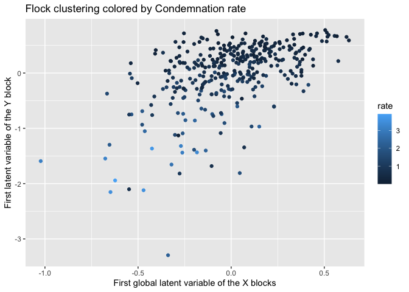

``` r
cor(resmbpls.chick$lX[,1:2], Mortality)
```

    ##          Mort7       Mort        Doa     Condemn
    ## Ax1 -0.1654811 -0.3162846 -0.1716641 -0.47463258
    ## Ax2  0.2808605  0.1774287 -0.3003845 -0.04471725

> [Condemnation](https://veterinaryrecord-bmj-com.ezproxy.library.ubc.ca/content/vetrec/180/21/516.full.pdf) (removal of products that are unsafe or unfit for human consumption) Condemnation rate = \# condemned/total \# slaughtered

> Imp! Dont pay much attention to sign of the correlation (sign ambiguity with SVD) - look in to RV coefficient matrix.

Block importance
----------------

``` r
setNames(resmbpls.chick$bip, c("t1", "t2")) %>% 
  as.data.frame() %>% 
  mutate(block_name = rownames(.)) %>% 
  gather(Comp, value, -block_name) %>% 
  ggplot(aes(x = Comp, y = value)) +
    geom_bar(stat = "identity") + 
    facet_wrap(~block_name) +
  ylab("Correlation with mortality (Y block)") +
  ggtitle("Correlation between latent variables in X blocks 
          with the corresponding latent variable in the Y block (mortality)")
```

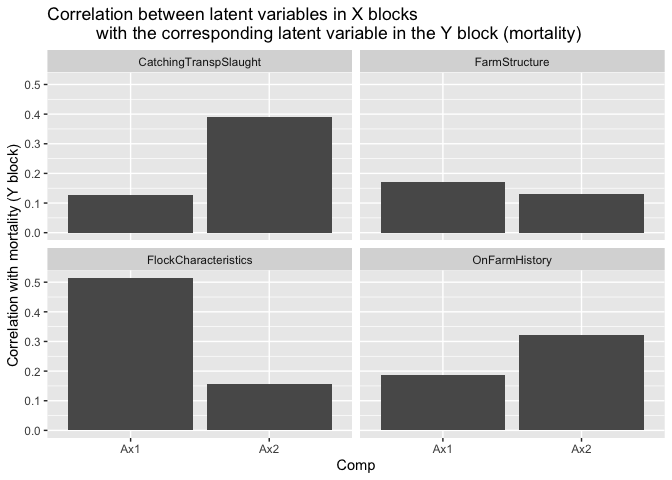

> flock characteristics more correlated with mortality in the first component (adjusted for other X blocks), whereas CatchingTranspSlaugt is more correlated with mortality in the second component (adjusted for other X blocks).

Individual component plots
--------------------------

``` r
indx <- resmbpls.chick$TlX %>% rownames(.) %>% as.numeric(.)
start <- which(indx == 1)
end <- c(start[-1]-1, nrow(resmbpls.chick$TlX))

indComps <- mapply(function(start, end){
  resmbpls.chick$TlX[start:end, ]
}, start = start, end = end, SIMPLIFY = FALSE)

indComps <- lapply(seq_len(length(indComps)), function(i){
  x <- indComps[[i]]
  colnames(x) <- paste(c("t1", "t2"), i, sep = "_")
  x
})

par(mfrow = c(2, 2))
for (i in 1:length(indComps)) {
  plot(indComps[[i]])
}
```

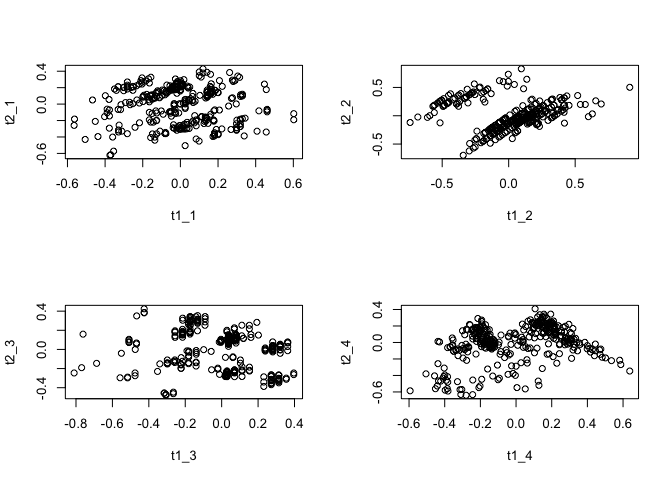

Variable importance
-------------------

``` r
resmbpls.chick$vip %>% 
  as.data.frame() %>% 
  mutate(variable_name = rownames(.),
    Dataset = rep(paste0("Dataset", 1:(length(chickenk) - 1)), sapply(chickenk[2:5], ncol))) %>% 
  rename(t1 = Ax1, t2 = Ax2) %>% 
  gather(comp, value, c("t1", "t2")) %>% 
  ggplot(aes(x = comp, y = value,fill = Dataset )) +
  geom_bar(stat = "identity") +
  facet_wrap(Dataset~variable_name)
```

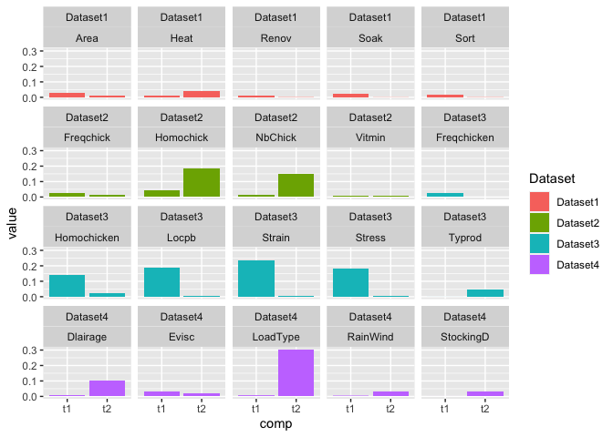

Multi-block Partial Least Squares (iterative)
=============================================

Algorithm
---------

1.  latent variable of Y block (projection of Y block): initialize latent variable of the Y block **u**
2.  weights of X blocks (regression of u onto X blocks): **w**<sub>*k*</sub> = ***X*<sub>*k*</sub><sup>*T*</sup>** **u**
3.  latent variables of X blocks (project of X blocks): **t**<sub>*k*</sub> = ***X*<sub>*k*</sub>** **w**<sub>*k*</sub>
4.  global latent variable of X block: **t** = ∑<sub>*k*</sub> **a**<sub>*k*</sub> **t**<sub>*k*</sub>
5.  compute latent variable of Y block (regression of t onto Y block): **u**=***Y*<sup>*T*</sup>** **t**
6.  repeat steps 1-5 until **t** stops changing

> pros: satisfies 1), 2), 3), 9) cons: cannot do 4), 5), 6), 7), 8)

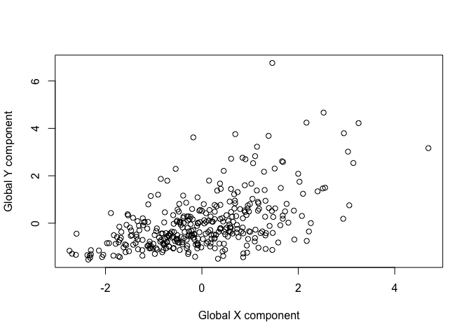

DIABLO2
-------

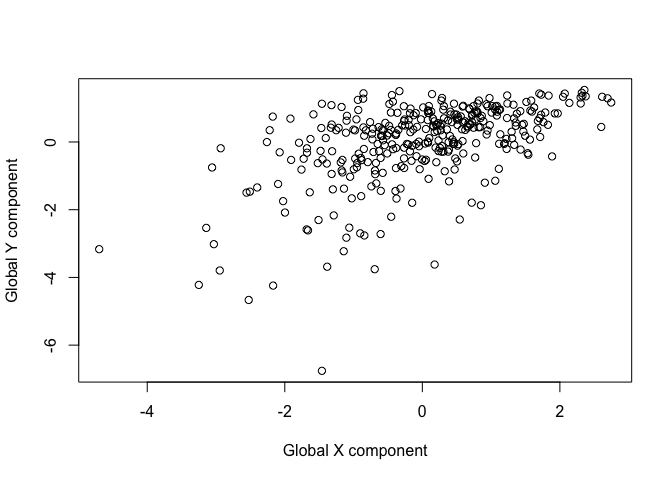

correlation with global components found using mbpls
----------------------------------------------------

``` r
plot(resmbpls.chick$lY[, 1], result$t_iter[[length(result$t_iter)]][, "u"],
     xlab="Y component using MBPLS (ade4)", ylab = "Y component using MBPLS (ade4)")
```

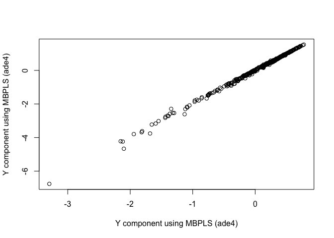

``` r
plot(resmbpls.chick$lX[, 1], result$t_iter[[length(result$t_iter)]][, "t"],
     xlab="Global X component using MBPLS (ade4)", ylab = "Global X component using MBPLS (ade4)")
```

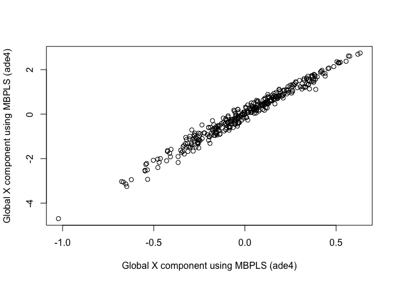

Regularized Generalized Canonical Correlation Analysis
======================================================

``` r
A <- chickenk
A = lapply(A, function(x) scale2(x, bias = TRUE))
# A = lapply(A, function(x) x/sqrt(NCOL(x)))

C <-  matrix(c(rep(0, 4), 1,
              rep(0, 4), 1,
              rep(0, 4), 1,
              rep(0, 4), 1,
              rep(1, 4), 0), nrow = length(A), ncol = length(A))
diag(C) <- 1

result_rgcca = rgcca_internal(A, C, scheme = "factorial")
pairs(result_rgcca$Z)
```

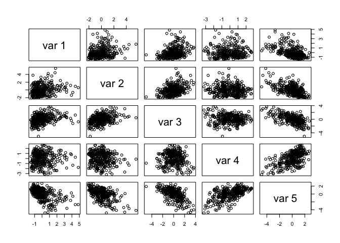

Sparse Generalized Canonical Correlation Analysis
=================================================

``` r
sgcca_internal <- function (A, C, c1 = rep(1, length(A)), scheme = "centroid", 
    scale = FALSE, tol = .Machine$double.eps, init = "svd", bias = TRUE, 
    verbose = TRUE) 
{
    J <- length(A)
    pjs = sapply(A, NCOL)
    AVE_X <- rep(0, J)
    if (init == "svd") {
        a <- lapply(A, function(x) return(svd(x, nu = 0, nv = 1)$v))
    }
    else if (init == "random") {
        a <- lapply(pjs, rnorm)
    }
    else {
        stop("init should be either random or svd.")
    }
    if (any(c1 < 1/sqrt(pjs) | c1 > 1)) 
        stop("L1 constraints must vary between 1/sqrt(p_j) and 1.")
    const <- c1 * sqrt(pjs)
    iter <- 1
    converg <- crit <- numeric()
    Y <- Z <- matrix(0, NROW(A[[1]]), J)
    for (q in 1:J) {
        Y[, q] <- apply(A[[q]], 1, miscrossprod, a[[q]])
        a[[q]] <- soft.threshold(a[[q]], const[q])
        a[[q]] <- as.vector(a[[q]])/norm2(a[[q]])
    }
    a_old <- a
    ifelse((mode(scheme) != "function"), {
        g <- function(x) switch(scheme, horst = x, factorial = x^2, 
            centroid = abs(x))
        crit_old <- sum(C * g(cov2(Y, bias = bias)))
    }, crit_old <- sum(C * scheme(cov2(Y, bias = bias))))
    if (mode(scheme) == "function") 
        dg = Deriv::Deriv(scheme, env = parent.frame())
    repeat {
        for (q in 1:J) {
            if (mode(scheme) == "function") {
                dgx = dg(cov2(Y[, q], Y, bias = bias))
                CbyCovq = C[q, ] * dgx
            }
            else {
                if (scheme == "horst") 
                  CbyCovq <- C[q, ]
                if (scheme == "factorial") 
                  CbyCovq <- C[q, ] * 2 * cov2(Y, Y[, q], bias = bias)
                if (scheme == "centroid") 
                  CbyCovq <- C[q, ] * sign(cov2(Y, Y[, q], bias = bias))
            }
            Z[, q] <- rowSums(mapply("*", CbyCovq, as.data.frame(Y)))
            a[[q]] <- apply(t(A[[q]]), 1, miscrossprod, Z[, q])
            a[[q]] <- soft.threshold(a[[q]], const[q])
            a[[q]] <- as.vector(a[[q]])/norm2(a[[q]])
            Y[, q] <- apply(A[[q]], 1, miscrossprod, a[[q]])
        }
        ifelse((mode(scheme) != "function"), {
            g <- function(x) switch(scheme, horst = x, factorial = x^2, 
                centroid = abs(x))
            crit[iter] <- sum(C * g(cov2(Y, bias = bias)))
        }, crit[iter] <- sum(C * scheme(cov2(Y, bias = bias))))
        if (verbose & (iter%%1) == 0) 
            cat(" Iter: ", formatC(iter, width = 3, format = "d"), 
                " Fit: ", formatC(crit[iter], digits = 8, width = 10, 
                  format = "f"), " Dif: ", formatC(crit[iter] - 
                  crit_old, digits = 8, width = 10, format = "f"), 
                "\n")
        stopping_criteria = c(drop(crossprod(Reduce("c", mapply("-", 
            a, a_old)))), abs(crit[iter] - crit_old))
        if (any(stopping_criteria < tol) | (iter > 1000)) 
            break
        crit_old = crit[iter]
        a_old <- a
        iter <- iter + 1
    }
    if (iter > 1000) 
        warning("The SGCCA algorithm did not converge after 1000 iterations.")
    if (iter < 1000 & verbose) 
        cat("The SGCCA algorithm converged to a stationary point after", 
            iter - 1, "iterations \n")
    if (verbose) 
        plot(crit, xlab = "iteration", ylab = "criteria")
    for (q in 1:J) if (sum(a[[q]] != 0) <= 1) 
        warning(sprintf("Deflation failed because only one variable was selected for block #", 
            q))
    AVE_inner <- sum(C * cor(Y)^2/2)/(sum(C)/2)
    result <- list(Y = Y, a = a, crit = crit[which(crit != 0)], 
        AVE_inner = AVE_inner, C = C, c1, scheme = scheme, Z=Z)
    return(result)
}
```

``` r
result_sgcca = sgcca_internal(A, C, scheme = "horst", init="random", bias=FALSE)
```

    ##  Iter:    1  Fit:  5.66757793  Dif:  -36.45851694 
    ##  Iter:    2  Fit:  6.03097301  Dif:  0.36339508 
    ##  Iter:    3  Fit:  6.37096626  Dif:  0.33999325 
    ##  Iter:    4  Fit:  6.72034811  Dif:  0.34938185 
    ##  Iter:    5  Fit:  7.08115881  Dif:  0.36081070 
    ##  Iter:    6  Fit:  7.42376540  Dif:  0.34260659 
    ##  Iter:    7  Fit:  7.71138374  Dif:  0.28761835 
    ##  Iter:    8  Fit:  7.92487738  Dif:  0.21349363 
    ##  Iter:    9  Fit:  8.06790228  Dif:  0.14302490 
    ##  Iter:   10  Fit:  8.15700383  Dif:  0.08910155 
    ##  Iter:   11  Fit:  8.21015433  Dif:  0.05315050 
    ##  Iter:   12  Fit:  8.24119360  Dif:  0.03103927 
    ##  Iter:   13  Fit:  8.25919225  Dif:  0.01799865 
    ##  Iter:   14  Fit:  8.26963808  Dif:  0.01044583 
    ##  Iter:   15  Fit:  8.27572989  Dif:  0.00609181 
    ##  Iter:   16  Fit:  8.27930573  Dif:  0.00357584 
    ##  Iter:   17  Fit:  8.28141936  Dif:  0.00211363 
    ##  Iter:   18  Fit:  8.28267718  Dif:  0.00125782 
    ##  Iter:   19  Fit:  8.28343042  Dif:  0.00075324 
    ##  Iter:   20  Fit:  8.28388406  Dif:  0.00045364 
    ##  Iter:   21  Fit:  8.28415866  Dif:  0.00027460 
    ##  Iter:   22  Fit:  8.28432562  Dif:  0.00016696 
    ##  Iter:   23  Fit:  8.28442754  Dif:  0.00010192 
    ##  Iter:   24  Fit:  8.28448997  Dif:  0.00006243 
    ##  Iter:   25  Fit:  8.28452832  Dif:  0.00003835 
    ##  Iter:   26  Fit:  8.28455195  Dif:  0.00002363 
    ##  Iter:   27  Fit:  8.28456653  Dif:  0.00001459 
    ##  Iter:   28  Fit:  8.28457556  Dif:  0.00000902 
    ##  Iter:   29  Fit:  8.28458115  Dif:  0.00000559 
    ##  Iter:   30  Fit:  8.28458462  Dif:  0.00000347 
    ##  Iter:   31  Fit:  8.28458678  Dif:  0.00000216 
    ##  Iter:   32  Fit:  8.28458813  Dif:  0.00000134 
    ##  Iter:   33  Fit:  8.28458897  Dif:  0.00000084 
    ##  Iter:   34  Fit:  8.28458949  Dif:  0.00000052 
    ##  Iter:   35  Fit:  8.28458982  Dif:  0.00000033 
    ##  Iter:   36  Fit:  8.28459002  Dif:  0.00000020 
    ##  Iter:   37  Fit:  8.28459015  Dif:  0.00000013 
    ##  Iter:   38  Fit:  8.28459023  Dif:  0.00000008 
    ##  Iter:   39  Fit:  8.28459028  Dif:  0.00000005 
    ##  Iter:   40  Fit:  8.28459031  Dif:  0.00000003 
    ##  Iter:   41  Fit:  8.28459033  Dif:  0.00000002 
    ##  Iter:   42  Fit:  8.28459034  Dif:  0.00000001 
    ##  Iter:   43  Fit:  8.28459035  Dif:  0.00000001 
    ##  Iter:   44  Fit:  8.28459036  Dif:  0.00000000 
    ##  Iter:   45  Fit:  8.28459036  Dif:  0.00000000 
    ##  Iter:   46  Fit:  8.28459036  Dif:  0.00000000 
    ##  Iter:   47  Fit:  8.28459036  Dif:  0.00000000 
    ##  Iter:   48  Fit:  8.28459036  Dif:  0.00000000 
    ##  Iter:   49  Fit:  8.28459036  Dif:  0.00000000 
    ##  Iter:   50  Fit:  8.28459036  Dif:  0.00000000 
    ##  Iter:   51  Fit:  8.28459036  Dif:  0.00000000 
    ##  Iter:   52  Fit:  8.28459036  Dif:  0.00000000 
    ##  Iter:   53  Fit:  8.28459036  Dif:  0.00000000 
    ##  Iter:   54  Fit:  8.28459036  Dif:  0.00000000 
    ##  Iter:   55  Fit:  8.28459036  Dif:  0.00000000 
    ##  Iter:   56  Fit:  8.28459036  Dif:  0.00000000 
    ##  Iter:   57  Fit:  8.28459036  Dif:  0.00000000 
    ##  Iter:   58  Fit:  8.28459036  Dif:  0.00000000 
    ##  Iter:   59  Fit:  8.28459036  Dif:  0.00000000 
    ##  Iter:   60  Fit:  8.28459036  Dif:  0.00000000 
    ##  Iter:   61  Fit:  8.28459036  Dif:  0.00000000 
    ##  Iter:   62  Fit:  8.28459036  Dif:  0.00000000 
    ##  Iter:   63  Fit:  8.28459036  Dif:  0.00000000 
    ##  Iter:   64  Fit:  8.28459036  Dif:  0.00000000 
    ##  Iter:   65  Fit:  8.28459036  Dif:  0.00000000 
    ##  Iter:   66  Fit:  8.28459036  Dif:  0.00000000 
    ##  Iter:   67  Fit:  8.28459036  Dif:  0.00000000 
    ##  Iter:   68  Fit:  8.28459036  Dif:  0.00000000 
    ##  Iter:   69  Fit:  8.28459036  Dif:  0.00000000 
    ##  Iter:   70  Fit:  8.28459036  Dif:  0.00000000 
    ##  Iter:   71  Fit:  8.28459036  Dif:  0.00000000 
    ##  Iter:   72  Fit:  8.28459036  Dif:  0.00000000 
    ##  Iter:   73  Fit:  8.28459036  Dif:  0.00000000 
    ##  Iter:   74  Fit:  8.28459036  Dif:  0.00000000 
    ##  Iter:   75  Fit:  8.28459036  Dif:  0.00000000 
    ##  Iter:   76  Fit:  8.28459036  Dif:  0.00000000 
    ##  Iter:   77  Fit:  8.28459036  Dif:  0.00000000 
    ##  Iter:   78  Fit:  8.28459036  Dif:  0.00000000 
    ##  Iter:   79  Fit:  8.28459036  Dif:  0.00000000 
    ## The SGCCA algorithm converged to a stationary point after 78 iterations

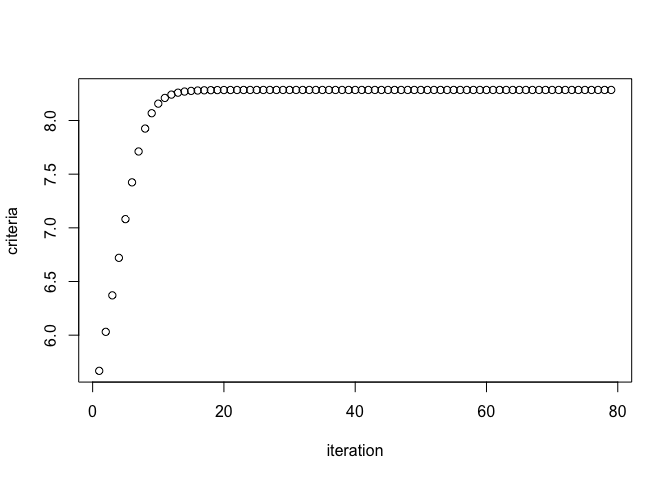

``` r
pairs(result_sgcca$Z)
```

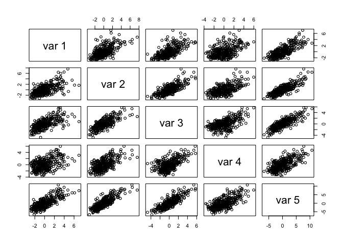

Compare block components of all methods
---------------------------------------

``` r
par(mfrow=c(1, 2))
plot(result_rgcca$Z[, 1], result$t_iter[[length(result$t_iter)]][, "t"], 
     xlab="RGCCA", 
     ylab="MBPLS (non-iterative)", 
     main="Global X component")
plot(result_rgcca$Z[, ncol(result_rgcca$Z)], result$t_iter[[length(result$t_iter)]][, "u"], 
     xlab="RGCCA", 
     ylab="MBPLS (non-iterative)", 
     main="Y component")
```

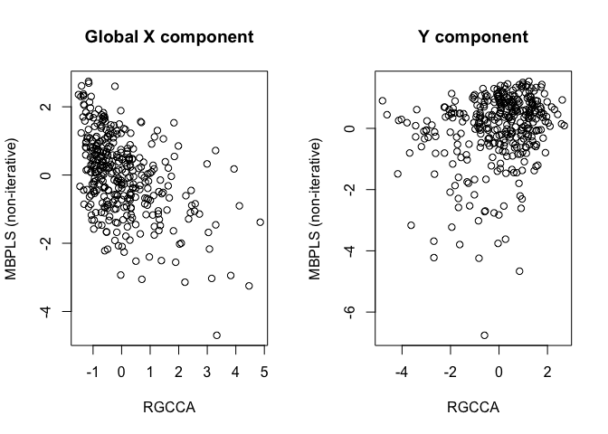

``` r
plot(result_sgcca$Z[, 1], result$t_iter[[length(result$t_iter)]][, "t"], 
     xlab="SGCCA", 
     ylab="MBPLS (non-iterative)", 
     main="Global X component")
plot(result_sgcca$Z[, ncol(result_rgcca$Z)], result$t_iter[[length(result$t_iter)]][, "u"], 
     xlab="SGCCA", 
     ylab="MBPLS (non-iterative)", 
     main="Y component")
```

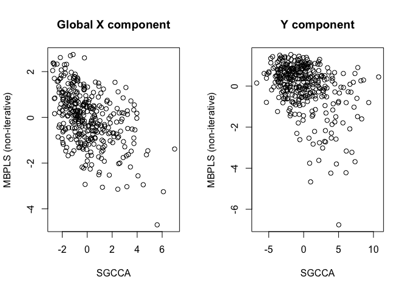

``` r
# dat <- data.frame(rgcca = as.vector(result_rgcca$Y),
#            mbpls = c(resmbpls.chick$TlX[,1], resmbpls.chick$lY[,1]))
# 
# plot(dat)
# 
# plot(resmbpls.chick$TlX[,1], rep(resmbpls.chick$lY[,1], 4))
```
